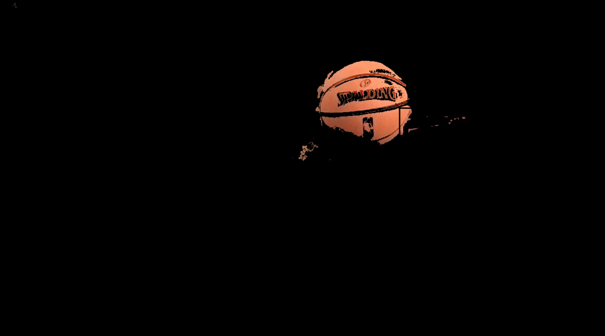
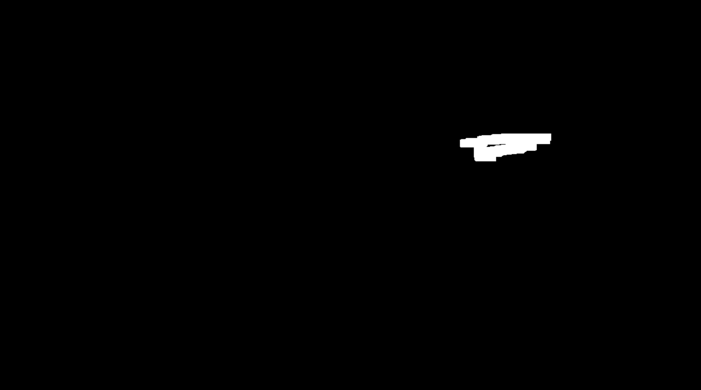
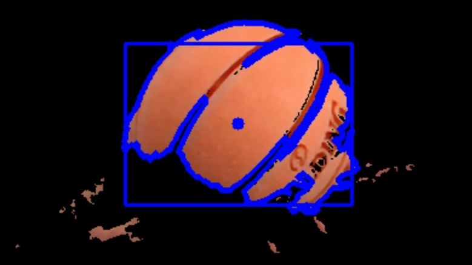
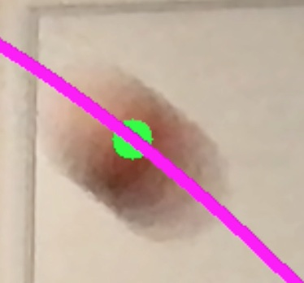
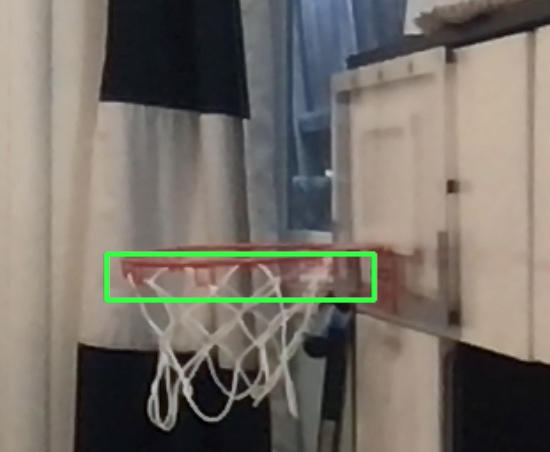
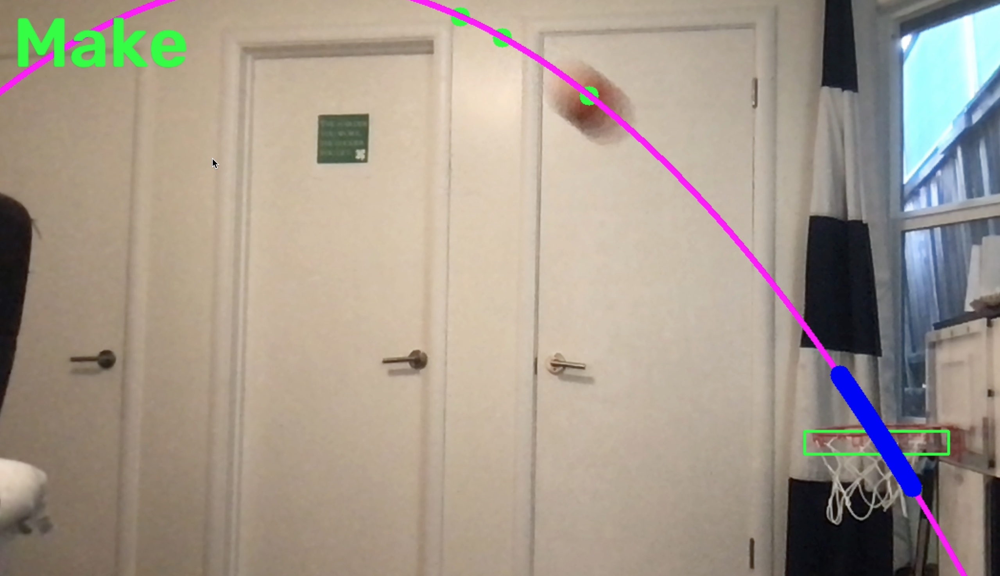
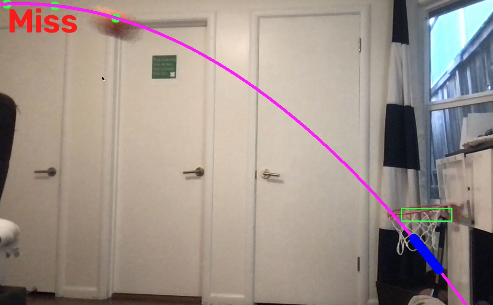

# Basketball Shot Predictor
This is a python project which tracks both a basketball and a rim against a background and predicts if the shot will be a make or a miss. 

<br>

## Computer Vision
the ball and rim are isolated from the background video using HSV color masking
```
ball_HSV_mask_vals = {'hmin': 0, 'smin': 125, 'vmin': 145, 'hmax': 10, 'smax': 255, 'vmax': 255}
rim_HSV_mask_vals = {'hmin': 0, 'smin': 59, 'vmin': 180, 'hmax': 5, 'smax': 103, 'vmax': 239}
```

<br>

| Ball Mask  | Rim Mask |
| -----------|--------- |
|   |    |

<br>

and then have binarization and dilation applied them. They are then detected through cvzones's ```findContours()``` function which returns the locations of all the contours, as well as a rectangle that surrounds them.
<br>



<br>

For the ball the center of this rectangle is used as its center and for the rim the left and rightmost points of the rectangle as well as the y position of the rectangle are used to determine if the ball will go in.

<br>

<p align="center"> 
  
</p>

<br>

## Prediction

The previously tracked points for the ball are run through numpy's ```polyfit()``` function to return coefficients for a parabola that predicts the ball's path. If the arc goes through the rim **Make** is displayed on the screen, and if it doesn't **Miss** is displayed.

<br>

<p align="center"> 
  
</p>

<br>

## Demonstration

 
